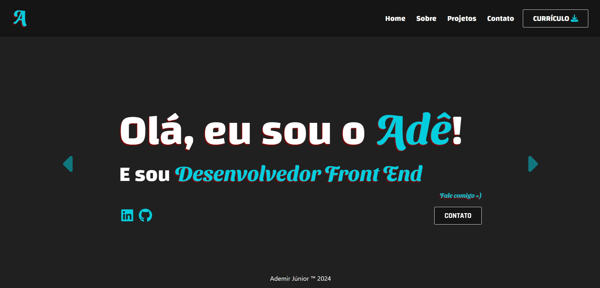

# Portifólio Online - jan/2024

### Bom, antes tarde do que nunca =)

Há aproximadamente dois anos iniciei meus estudos sobre programação, atraído por uma pequena ambição ao desenvolvimento web. Começando por assistir ao curso de JavaScript do Gustavo Guanabara no Youtube, foi uma ótima experiência escrever o meu primeiro ```Hello World!```

Um ano depois ingressei na faculdade de Ciência da Computação e, assim como esperava, me apaixonei pelo ato de "codar". Infelizmente, devido às demandas da faculdade e à complexidade que enfrentava como um "aspirante a dev", meus estudos de desenvolvimento front end ficaram um pouco estagnados ... até o mês o passado.

Este ano, decidi me dedicar ao desenvolvimento front end (logo logo fullstack) e encarar o título de desenvolvedor como minha carreira profissional de fato. E para dar o ponta pé inicial, apresento a vocês meu primeiro portifólio online, desenvolvido com HTML5, CSS3, Bootstrap5 e JavaScript puro: [Acesse-o aqui](https://adejunior.netlify.app/)


